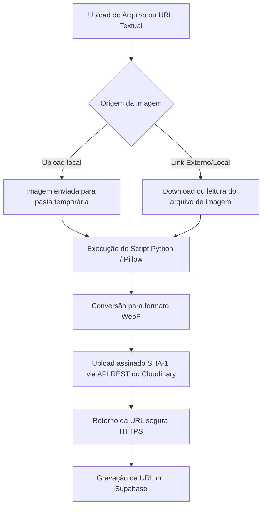

# 🎨 Especificações de Design e Tipografia — Painel TechDeal

Este arquivo contém referências rápidas sobre o layout, dimensões e a escala de fontes configurada no painel administrativo do TechDeal.

---

## 📏 Dimensões de Layout do Painel

| Componente | Propriedade | Valor Configurado | Descrição |
| :--- | :--- | :--- | :--- |
| **Grid do Painel** | `grid-template-columns` | `220px 1fr` | Barra lateral (sidebar) enxuta à esquerda com o conteúdo principal ocupando o restante da tela. |
| **Cabeçalho** | `height` | `64px` | Altura do topo (header) do site. |
| **Sidebar (Altura)** | `height` | `calc(100vh - 64px)` | Sidebar fixa na tela, colada logo abaixo do cabeçalho. |
| **Sidebar (Padding)** | `padding` | `1rem 0.6rem` | Espaçamento minimalista ao redor da navegação. |
| **Content Area** | `padding` | `0` | Margens externas zeradas para colagem completa nas bordas do monitor. |
| **Card Principal** | `padding` | `1.25rem 2.5rem 2.5rem 2.5rem` | Margem interna do canvas administrativo (topo de `1.25rem` para subir o conteúdo). |

---

## 🔤 Tamanhos de Fontes (Tipografia)

Estas são as escalas tipográficas enxutas definidas para o painel de administração:

```css
/* Escala de tipografia definida para o Panel Administrativo */

.painel-content {
  font-size: 0.88rem; /* Escala global de texto reduzida na área administrativa */
}

.painel-card h1 {
  font-size: 1.4rem !important; /* Título principal h1 de cada seção */
}

.painel-card p {
  font-size: 0.85rem !important; /* Texto descritivo/subtítulo */
}

.sidebar-nav a {
  font-size: 0.85rem; /* Links de navegação do menu lateral */
  padding: 0.6rem 0.75rem; /* Compactação dos botões da sidebar */
}

.admin-table {
  font-size: 0.82rem; /* Fonte da tabela de produtos do CRUD */
}

.admin-table th, .admin-table td {
  padding: 0.35rem 0.75rem; /* Padding reduzido para diminuir a altura das linhas */
}

/* Regras de truncamento com reticências para ocupar apenas uma linha */

.ellipsis-cell-title {
  max-width: 260px; /* Limite de largura do Título do Produto na listagem */
  white-space: nowrap;
  overflow: hidden;
  text-overflow: ellipsis;
}

.ellipsis-cell-compare {
  max-width: 130px; /* Limite de largura do Slug do Comparativo na listagem */
  white-space: nowrap;
  overflow: hidden;
  text-overflow: ellipsis;
}

/* Tamanho específico da largura das colunas da tabela de listagem */

th:nth-child(5) {
  width: 145px; /* Define largura explícita de 145px para a coluna de Lojas */
}

th:nth-child(8) {
  width: 80px; /* Define largura de 80px para a coluna de Ações (compactada) */
}

/* Badges, Imagens e Botões de ação compactos */

.tag-amazon, .tag-ml {
  white-space: nowrap; /* Garante que 'Mercado Livre' ou outras lojas não quebrem linha */
}

.admin-thumb {
  width: 32px; /* Miniatura do produto reduzida para 32px de altura */
  height: 32px;
}

.btn-action {
  padding: 0.35rem 0.5rem; /* Botões menores para os emojis ✏️ e 🗑️ */
  font-size: 0.75rem;
}
```

---

## ☁️ Armazenamento de Imagens (Cloudinary & WebP)

Para otimização de performance e entrega rápida de assets através de CDN, todas as imagens do catálogo do TechDeal são processadas e armazenadas no Cloudinary em formato otimizado WebP.

### Fluxo de Processamento de Imagens



### Configurações de API e Módulos Usados

*   **Cloudinary Cloud Name**: `dpidtimit`
*   **Pipeline de Conversão**: Executado via `python3 cloudinary_uploader.py`. Utiliza a biblioteca **Pillow** (`PIL.Image`) para realizar a conversão independente de extensões adicionais habilitadas no PHP.
*   **API REST do Cloudinary**: Upload realizado via método HTTP POST com payload multipart/form-data assinado (SHA-1). Os parâmetros assinados em ordem alfabética são `folder` e `timestamp`.
*   **Helper PHP**: Implementado em `cloudinary_helper.php`. Contém o método `handle_image_upload_or_url($_FILES['imagem_file'], $_POST['imagem_url'])` que automatiza o fallback e o processamento de imagens novas e existentes.

